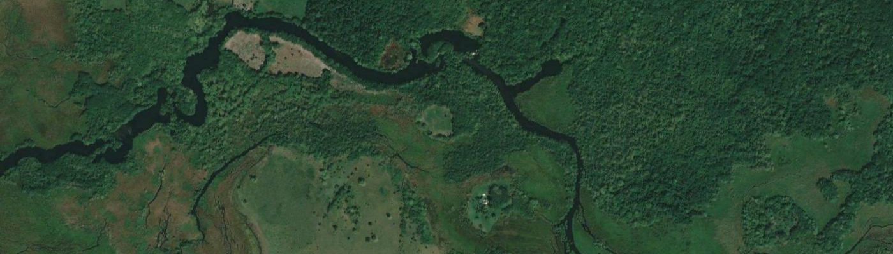

# land_cover_analysis
Land cover classification and change analysis



# Land Cover classification with machine learning

Land cover classification in the Yucatan Peninsula, Mexico as defined by
Bauer-Gottwein, et al. (2011). The characteristics of this study are:

 * Features from Landsat 8 OLI from 2013-2022 using surface reflectance bands:
   (Red, Green, Blue, NIR, SWIR1, and SWIR2), and vegetation indices (NDVI, EVI2).
 * Labels from INEGI's Use of Soil and Vegetation product (Mexico), grouped in 11
   land use and land cover classes.
 * Random Forest classifier with 250 trees (scikit-learn).
 * Model makes pixel-wise predictions at Landsat resolution.
 * 10%-90% training-testing split.
 * 10% of each class was selected with a stratified random sampling and used for
   training.

# Requirements

Code runs on Python 3 using anaconda3 modules, a conda environment with the
following modules should be prepared and activated to run this code (only the
main modules are listed, some additional dependecies may be required for
specific tasks, e.g. visualization):

  * python 3.8.x
  * numpy 1.23.x
  * matplotlib 3.5.x
  * gdal 3.4.x
  * scikit-learn 1.1.2

**IMPORTANT**: there are known issues for some versions of **gdal** and **matplotlib**,
the provided versions work fine.

# Environments

To create an identic environment you can run the following command and use the
provided text file (you can choose a different name than *rsml*):

```
$ conda create --name rsml --file rsml_environment.txt
```

Then activate the rsml:

```
$ conda activate rsml
```

# Data preprocessing

Preprocessing tasks are carried out with specific tools created in the VIP lab
by Dr. Armando Barreto-Muñoz in the format of Linux binaries. They take as input
Landsat 8 OLI scenes (GeoTIFF) located at specific directories and create
HDF4 files as output.
All the parameters for these programs should be provided in the
terminal or through Bash scripts.

There are three main operations:

  1. **Mosaicking**. Stiches Landsat scenes from the input and extracts a
    mosaic for the region of interest in HDF4 format.
  2. **Reprojection**. Resamples into Albers Equal Area conical projection
    using an USGS's ARD-like tiling system. See data for full parameters.
  3. **Statistics**. Calculates and creates stats files with mean, max, min,
    and standard deviation of each Landsat band. Results are presented as
    monthly summaries. Then aggregated by season (Spring, Summer, Fall, & Winter).
  4. **Phenology**. Calculates phenology metrics based on vegetation indices
    (NDVI), using the VIPHEN model (Barreto-Munoz et al., 2010; Didan et al., 2018).
  5. All these steps generate a total of 88 features (per pixel) from the Landsat
    data.

These files are utilized as features/predictors of the machine learning
algorithms and used for training. The land cover classes from GAP or INEGI
are used as labels.

# Running

Run the main script located in the **src/** directory.

# Changelog:

  * 2022/11/18: first version of repo structure.
  * 2023/05/19: completed the main module, scripts, and main bash script.
  * 2024/03/06: finished main code that runs correctly.
  * 2025/06/12: latest updates in the repository. No significant changes in code.

# References

  * Bauer-Gottwein, Peter, Bibi R.N. Gondwe, Guillaume Charvet, Luis E. Marín, Mario Rebolledo-Vieyra, and Gonzalo Merediz-Alonso. “Review: The Yucatán Peninsula Karst Aquifer, Mexico.” Hydrogeology Journal 19, no. 3 (May 2011): 507–24. https://doi.org/10.1007/s10040-010-0699-5.
  * Didan, Kamel, Armando Barreto-Munoz, Tomoaki Miura, Javzandulm Tsend-Ayush, Xiaoyang Zhang, Mark Friedl, Josh Gray, et al. 2018. “Multi-Sensor Vegetation Index and Phenology Earth Science Data Records.” Algorithm Theoretical Basis Document and User Guide Version 4.1. Tucson, Arizona: The University of Arizona.
  * Barreto-Munoz, A., K. Didan, J. Rivera-Camacho, and M. Yitayew. 2010. “A New Hybrid Method for Remote Sensing Time Series Reconstruction in Support of Land Surface Phenology.” In AGU Fall Meeting Abstracts, 2010:IN21C-1345.


